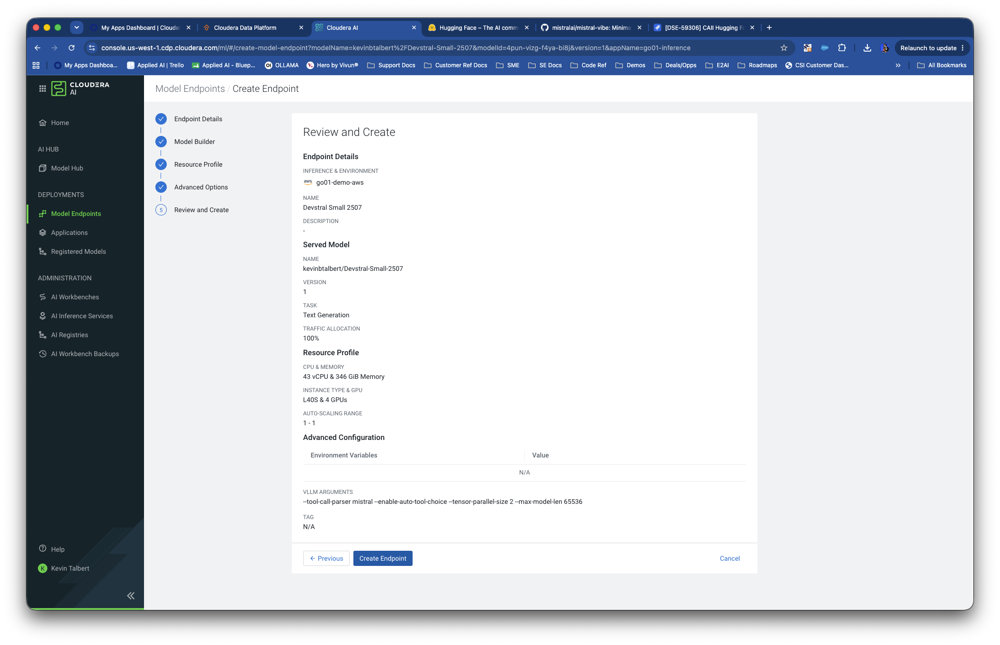
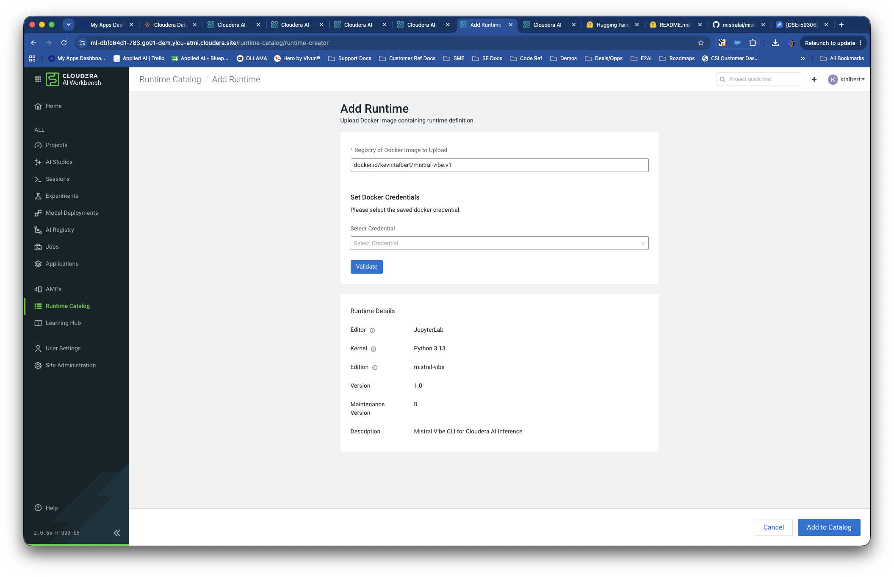
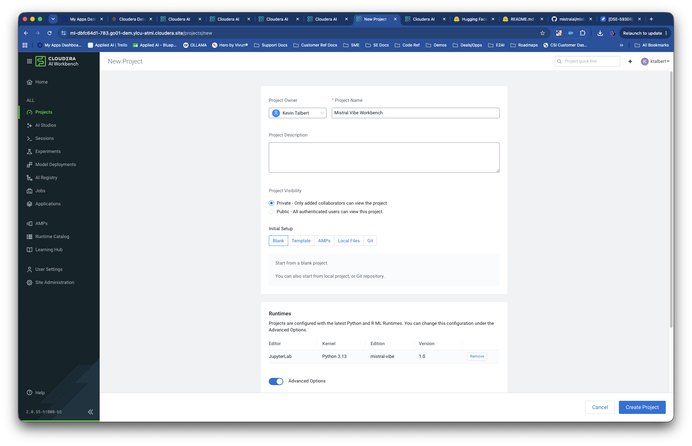
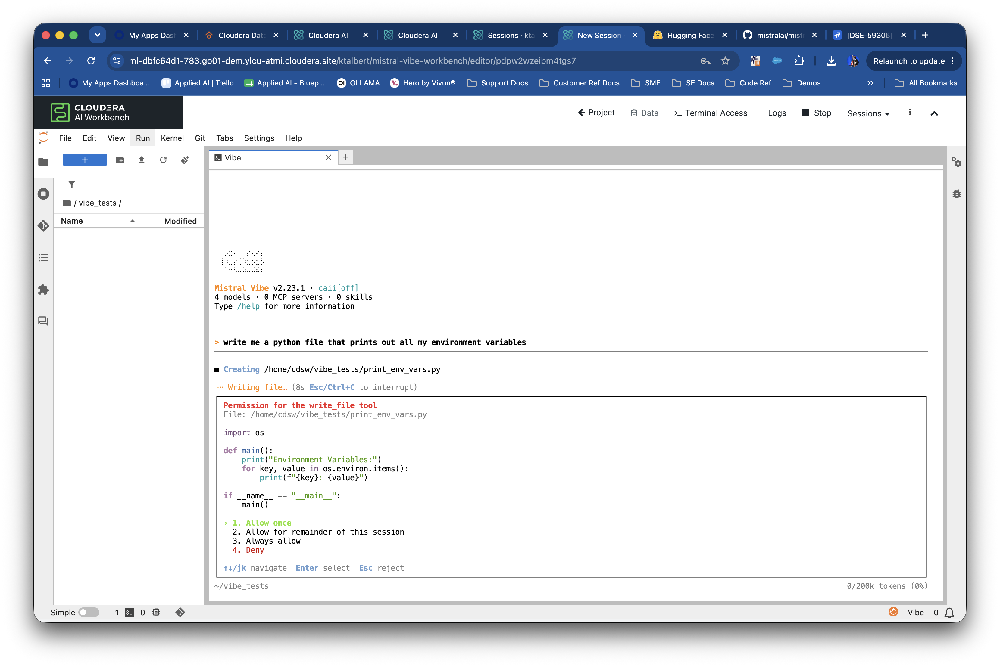
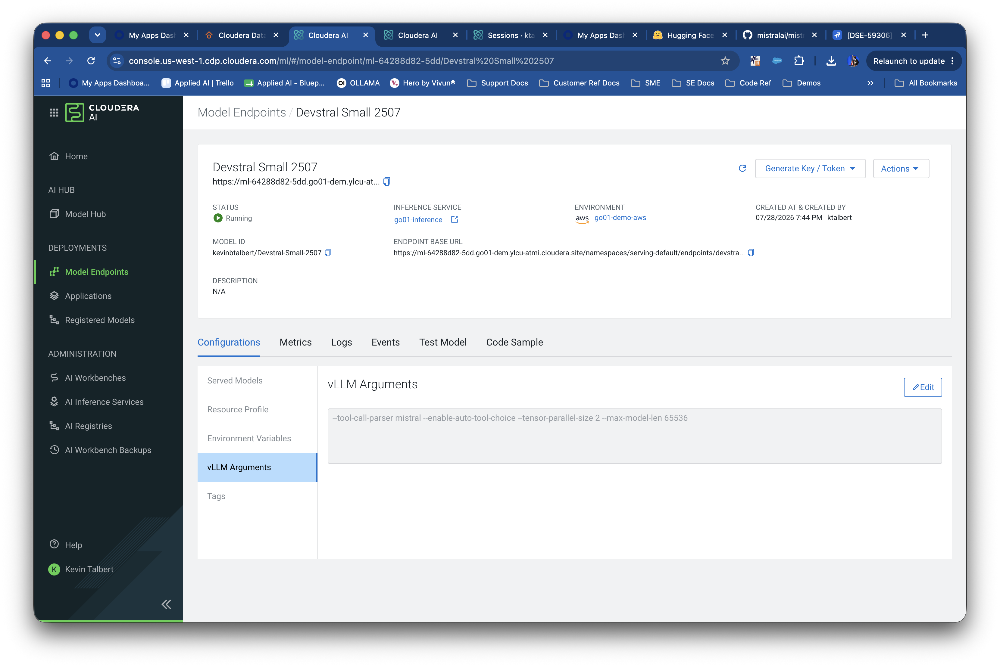

# Cloudera Blueprint: Mistral Vibe with Cloudera AI Inference

> Run [Mistral Vibe](https://github.com/mistralai/mistral-vibe) in Cloudera AI Workbench against a model on [Cloudera AI Inference (CAII)](https://docs.cloudera.com/machine-learning/cloud/ai-inference/topics/ml-caii-use-caii.html). Vibe uses CAII’s **OpenAI-compatible** API directly. Catalog: [`METADATA.yaml`](METADATA.yaml).

## Table of Contents

- [Overview](#overview)
- [Demo](#demo)
- [Use Case](#use-case)
- [Key Features](#key-features)
- [Quickstart](#quickstart)
- [Recommended model](#recommended-model)
- [Architecture / Software Components](#architecture--software-components)
- [Target Audience](#target-audience)
- [Repository Structure](#repository-structure)
- [Prerequisites](#prerequisites)
- [Hardware Requirements](#hardware-requirements)
- [Troubleshooting](#troubleshooting)
- [Documentation](#documentation)
- [Optional: local install](#optional-local-install)

## Overview

This blueprint connects **Mistral Vibe**—Mistral’s terminal coding agent—to **your CAI Inference (CAII) model endpoint**. A custom **workbench runtime image** preinstalls Vibe and syncs configuration from three project environment variables; inference stays on CAII (HF + vLLM or NIM). You get a private, enterprise-hosted agent workflow on Cloudera without routing traffic through Mistral’s public API.

## Demo

- Screenshots in [`assets/`](assets/) (endpoint, project env vars, runtime, Vibe CLI).


## Use Case

**Problem:** Teams want **agentic coding** (shell, edits, search) on **models they operate inside Cloudera**, with CDP authentication and existing CAII deployments.

**Outcome:** Deploy **Devstral** on CAII, register this runtime, set three env vars, run **`vibe-sync-config`** and **`vibe`** in a workbench terminal.

## Key Features

- **Custom CAI runtime** with Mistral Vibe and agent-friendly tooling preinstalled
- **Pre-built image** supported—no Docker build required for most users
- **Config from env** (`CAII_*`) + `vibe-sync-config`; JWT not written to disk
- **OpenAI-compatible** CAII route—same pattern as endpoint **Code Sample**
- **Optional local path** via `vibe-cai` on Mac/Linux

## Quickstart

### 1. Deploy CAI Inference model endpoint

Create a Hugging Face + vLLM endpoint using the [recommended model](#recommended-model) below.



### 2. Register the workbench runtime

**Option A (recommended):** Add the **maintainer’s pre-built runtime image** to **Admin → Runtime Catalog → Add Runtime** (use the image tag shared with your organization).

**Option B:** Build and register from this repo:

```bash
docker build --pull --rm -f Dockerfile -t <your-registry>/cai-mistral-vibe:1.0.0 .
# push to your registry, then Add Runtime in the catalog
```

Or use the already built runtime:
```bash
docker.io/kevintalbert/mistral-vibe:v1
# Add Runtime directly by pasting the link to the catalog
```



Create a project with that runtime and start a session.



### 3. Set environment variables

**Project → Settings → Advanced → Environment Variables** → **Submit**, then **restart the session** (stop/start workbench or start a new session).

| Name | Value |
|------|--------|
| `CAII_OPENAI_BASE_URL` | From endpoint **Code Sample** — include `/openai/v1` for vLLM (e.g. `…/endpoints/devstral-small-2507/openai/v1`) |
| `CAII_API_TOKEN` | **Generate JWT Token** on the endpoint |
| `CAII_MODEL` | Model id from **Test Model** or `GET …/models` (e.g. `kevinbtalbert/Devstral-Small-2507`) |

Use **`CAII_MODEL`**, not `CAII_MODEL_NAME` (`CAII_MODEL_NAME` is for local install only).

### 4. Sync and run Vibe

In a JupyterLab terminal:

```bash
vibe-sync-config
vibe
```

That is the full runtime path: **three env vars, sync, `vibe`**. `vibe` also refreshes config on launch when all `CAII_*` vars are set.



## Recommended model

Use **[Devstral-Small-2507](https://huggingface.co/kevinbtalbert/Devstral-Small-2507)** on CAII **1.13.x** (text + tool calling; validated on HF + vLLM).



**Example vLLM arguments** (match GPU count on the endpoint):

```text
--tool-call-parser mistral --enable-auto-tool-choice --tensor-parallel-size 2 --max-model-len 65536
```

Allowed vLLM flags in the UI: [CAII supported vLLM arguments](https://docs.cloudera.com/machine-learning/cloud/release-notes/topics/ml-caii-supported-vllm-command-line-arguments.html).

## Architecture / Software Components

```text
┌─────────────────────┐     OpenAI-compatible      ┌──────────────────────┐
│  CAI Workbench      │  ──  /chat/completions  ──► │  CAII model endpoint │
│  (this runtime)     │      Bearer: CDP JWT        │  (vLLM / Devstral)   │
│  mistral-vibe CLI   │                             │  KServe / GPU nodes  │
└─────────────────────┘                             └──────────────────────┘
```

| Component | Role |
|-----------|------|
| **Cloudera AI Inference** | Serves the model (HF import + vLLM in this blueprint) |
| **Custom runtime image** | JupyterLab + `mistral-vibe`; `scripts/cai-runtime-startup.sh` syncs `config.toml` |
| **Mistral Vibe** | Agent CLI (`vibe`) — tools, bash, edits |
| **CDP JWT** | Auth to CAII endpoint |

## Target Audience

- **ML / AI engineers** running coding agents on private inference
- **Platform engineers** registering runtimes and CAII endpoints
- **Solution architects** using Mistral and Cloudera without external API dependency

## Repository Structure

| Path | Description |
| --- | --- |
| `assets/` | Screenshots for README and demos |
| `config/vibe-caii.config.toml.template` | Vibe config template (filled from `CAII_*` env) |
| `scripts/cai-runtime-startup.sh` | Runtime profile hook: `vibe`, `vibe-sync-config` |
| `scripts/install-cai-vibe.sh` | Optional local install → `vibe-cai` |
| `Dockerfile` | Workbench runtime image definition |
| `METADATA.yaml` | Blueprint catalog metadata |

## Prerequisites

- Cloudera AI with **AI Inference** and **Workbench** (runtime catalog access for admins)
- A **running CAII endpoint** and permission to **Generate JWT Token**
- For local install only: `curl`, network to CAII, `git`
- For custom image build: `docker`, registry push access

## Hardware Requirements

Sizing is for the **CAII model** (not the workbench runtime).

| Deployment | Guidance |
| --- | --- |
| **Devstral-Small-2507 (demo)** | **2 GPUs** for `--tensor-parallel-size 2` (e.g. **g6e.12xlarge**); `--max-model-len 65536` as above |
| **Workbench runtime** | Standard session resources (e.g. 2 vCPU / 4gb RAM); no GPU on the workbench pod |

## Troubleshooting

| Issue | Fix |
|-------|-----|
| Banner: “Set CAII_* …” | All three vars set? **`CAII_MODEL`** (not `CAII_MODEL_NAME`)? **New session** after Submit? |
| `vibe-sync-config` fails | Same as above |
| `401` | New JWT in `CAII_API_TOKEN` |
| Cannot reach model | `curl -H "Authorization: Bearer $CAII_API_TOKEN" "$CAII_OPENAI_BASE_URL/models"` |
| Chat OK, tools weak | Devstral + vLLM tool flags on the endpoint |

## Documentation

- [CAI Inference overview](https://docs.cloudera.com/machine-learning/cloud/ai-inference/topics/ml-caii-use-caii.html)
- [CAI Authentication](https://docs.cloudera.com/machine-learning/cloud/ai-inference/topics/ml-caii-authentication.html)
- [Mistral Vibe](https://github.com/mistralai/mistral-vibe)
- [Supported vLLM CLI args (CAII)](https://docs.cloudera.com/machine-learning/cloud/release-notes/topics/ml-caii-supported-vllm-command-line-arguments.html)

---

## Optional: local install

On a laptop (uses **`CAI_API_BASE`**, **`CAI_CDP_TOKEN`**, **`CAI_MODEL_NAME`** — not `CAII_*`):

```bash
git clone https://github.com/kevinbtalbert/Mistral-Vibe-CLI-with-CAI-Inference.git
cd Mistral-Vibe-CLI-with-CAI-Inference
./scripts/install-cai-vibe.sh
vibe-cai
```

MIT © 2026 Cloudera, Inc.
